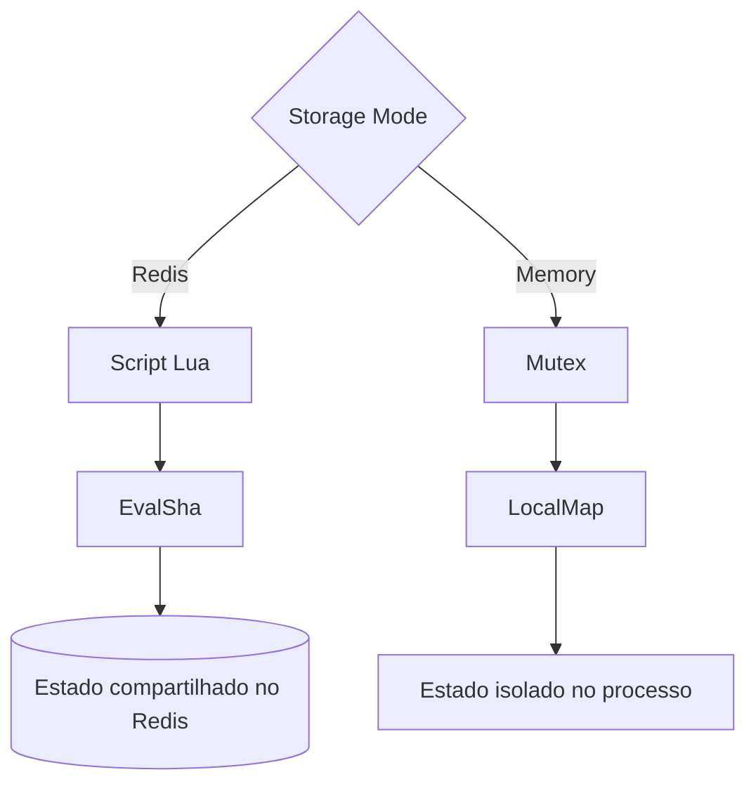
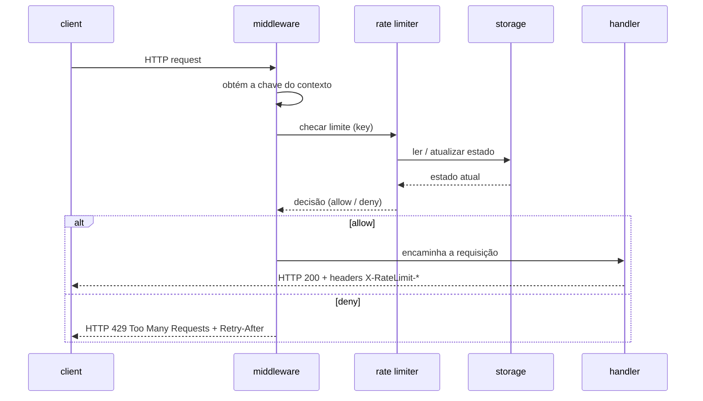
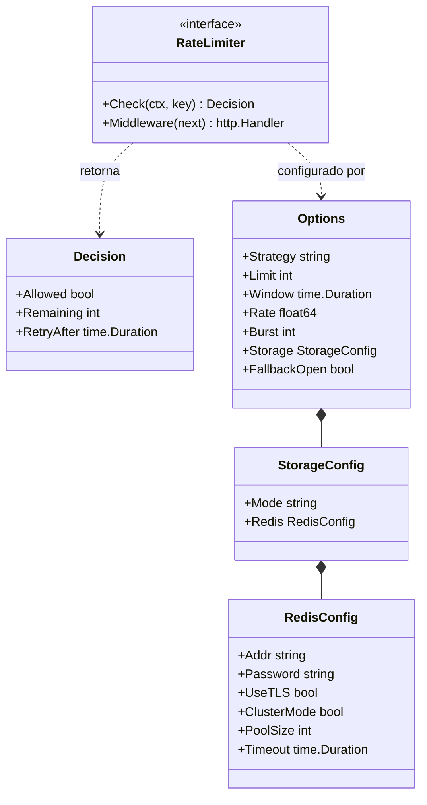
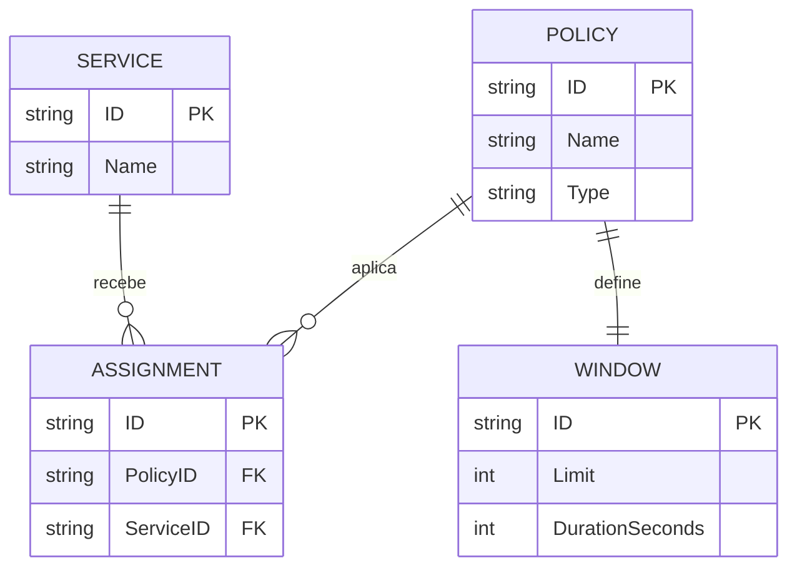
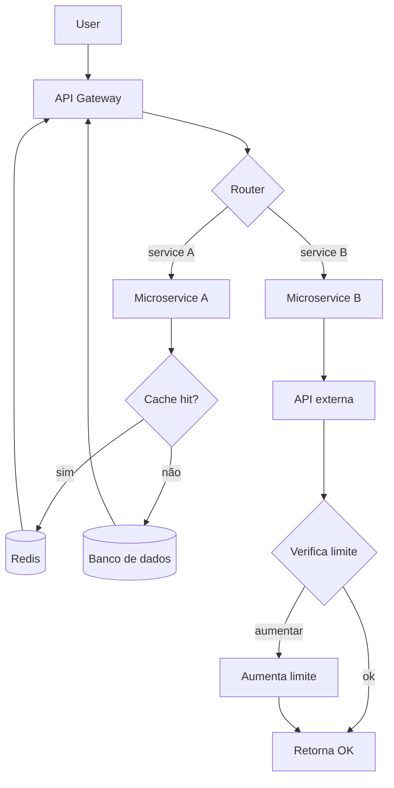
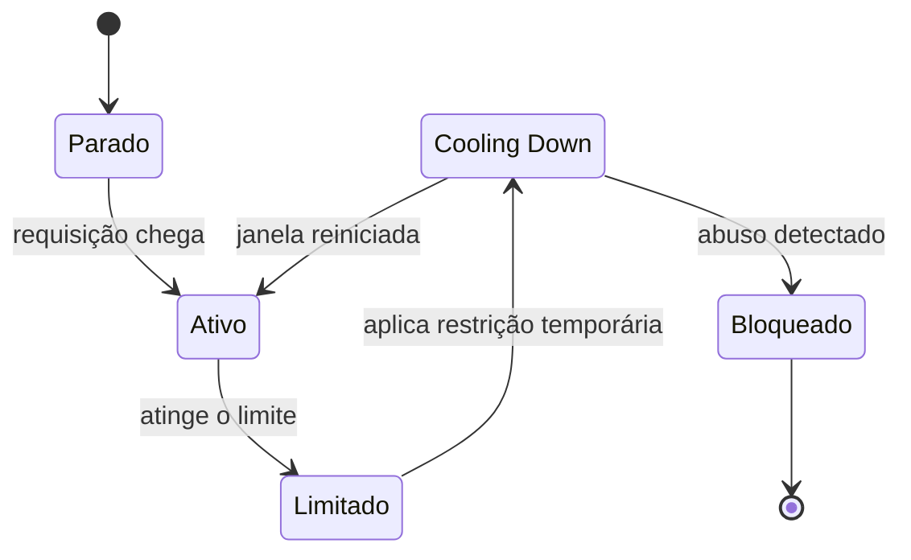

# Módulo 3 - Diagramas (Design e Arquitetura)

## Sumário

- [Aula 1: Introdução a Diagramas](#aula-1-introdução-a-diagramas)

- [Aula 2: Introdução aos diagramas C4](#aula-2-introdução-aos-diagramas-c4)

- [Aula 3: C1 - System Context](#aula-3-c1---system-context)

- [Aula 4: C2 - Containers](#aula-4-c2---containers)

- [Aula 5: C3 - Components](#aula-5-c3---components)

- [Aula 6: C4 - Code](#aula-6-c4---code)

- [Aula 7: Prompts e agentes](#aula-7-prompts-e-agentes)

- [Aula 8: Gerando diagrama C4](#aula-8-gerando-diagrama-c4)

- [Aula 9: Diagramas Mermaid](#aula-9-diagramas-mermaid)

- [Aula 10: Flowchart e Sequence Diagram](#aula-10-flowchart-e-sequence-diagram)

- [Aula 11: Prática, Class e ER Diagram](#aula-11-prática-class-e-er-diagram)

- [Aula 12: State Diagram](#aula-12-state-diagram)

- [Aula 13: Gerando diagramas Mermaid com IA](#aula-13-gerando-diagramas-mermaid-com-ia)

## Aula 1: Introdução a Diagramas

Esta aula apresenta os **diagramas** como forma de **reduzir o custo cognitivo** de entender um sistema descrito em texto. O ponto-chave na era da IA é parar de desenhar do zero e passar a **derivar o diagrama da especificação** (HLD, FDD, LLD, ADRs, RFCs) que já é a fonte de verdade. Apresenta dois eixos complementares — **C4** (granularidade arquitetural) e **Mermaid** (linguagem textual leve) — sempre com **revisão humana** sobre o que a IA gera.

---

### 1. Diagramas como redução de custo cognitivo
* **Para que existem:** Reduzir o esforço de entender um sistema descrito em texto.
* **O problema do texto:** Documentos acumulam regras, componentes, decisões e exceções em muitas linhas, dificultando ver estrutura, dependências e fluxo.
* **A compressão visual:** A representação espacial é mais fácil de inspecionar e comunicar.
* **Ganho duplo:** Melhora a análise técnica e o alinhamento com time, liderança e demais áreas.

### 2. O atrito histórico para criar e manter diagramas
* **Valiosos, mas caros:** Sempre ajudaram, mas eram custosos de produzir e manter.
* **Causas do atrito:** Ferramentas específicas, metodologias pesadas e esforço manual de atualização — muitos times desistiam ou deixavam o diagrama desatualizado.
* **Paradoxo comum:** Onde a arquitetura era mais complexa, a documentação visual era a que mais faltava.
* **Sem manutenção:** O diagrama deixava de esclarecer e passava a **competir com a realidade**.

### 3. A especificação como fonte de verdade
* **Derivar, não desenhar do zero:** O diagrama nasce da especificação que já existe.
* **As fontes:** HLD, Feature Design Docs, LLD, ADRs e RFCs concentram as decisões e servem de base para visões visuais consistentes.
* **Novo papel do diagrama:** Deixa de ser artefato isolado e vira **projeção da documentação textual**.
* **Dependência:** Quanto melhor a especificação, maior a chance de diagramas úteis e coerentes.

### 4. IA para geração e atualização de diagramas
* **Reduz o esforço:** Transformar texto técnico em representação visual fica mais barato.
* **Como opera:** Pedir que a IA extraia atores, componentes, relações e nível de detalhe direto da especificação.
* **Ganho na manutenção:** Quando o projeto evolui, atualizar o documento-fonte é mais barato do que redesenhar tudo.
* **Não elimina validação:** A automação acelera um **rascunho revisável**, não uma verdade pronta.

### 5. Revisão humana obrigatória
* **Não é verdade automática:** O modelo pode inferir relações inexistentes, omitir restrições ou exagerar a granularidade.
* **O que a revisão garante:** Aderência à arquitetura real, ao vocabulário do domínio e ao objetivo do diagrama.
* **Uso correto:** Assistivo — a IA produz e atualiza mais rápido, mas a **responsabilidade técnica** fica com quem conhece o sistema.

### 6. C4 como estrutura de granularidade
* **O que é:** Uma forma de representar sistemas em **níveis progressivos** de detalhe.
* **Seu valor:** Organiza a arquitetura por camadas, do panorama amplo ao recorte específico.
* **Escolher o nível certo:** Evita misturar contexto executivo com detalhe de implementação.
* **Cuidado:** Granularidade excessiva gera custo e ruído — nem todo nível precisa ser usado.

### 7. Mermaid como linguagem textual leve
* **Outra lógica:** Em vez de priorizar estrutura arquitetural como o C4, oferece **sintaxe textual** para descrever diagramas direto em texto.
* **Documentação versionada:** O diagrama vive no mesmo repositório e arquivo da especificação.
* **Barreira menor:** Facilita a adoção no dia a dia.
* **Quando brilha:** Quando rapidez, portabilidade e edição simples importam mais que formalismo arquitetural.

### 8. Renderização automática em Markdown e GitHub
* **Vantagem prática:** Ambientes com Markdown enriquecido (como o GitHub) renderizam o bloco Mermaid sem ferramenta externa.
* **Menos atrito:** Facilita revisão em pull requests e mantém código, documentação e diagrama próximos.
* **Consequência:** Atualizar o diagrama passa a se parecer com **editar texto**, não operar software gráfico.

### 9. Dois eixos complementares para representar sistemas
* **Não competem:** C4 e Mermaid resolvem problemas diferentes e podem coexistir.
* **C4:** Estrutura forte para pensar **níveis de abstração** arquitetural.
* **Mermaid:** Forma leve e textual de **materializar** diagramas em documentação contínua.
* **Com IA:** A mesma especificação origina visões distintas com menos esforço manual.

## Aula 2: Introdução aos diagramas C4

Esta aula apresenta o **modelo C4** como documentação arquitetural em **camadas progressivas** de detalhe: contexto (C1), containers (C2), componentes (C3) e código (C4-Code). A regra central é a **leitura progressiva** — cada nível aprofunda o anterior sem substituí-lo —, escolhendo o nível certo para a pergunta certa. Cita as referências do ecossistema (c4model.com, Structurizr, PlantUML) e mantém o **Rate Limiter** como exemplo contínuo, agora observado em camadas.

---

### 1. Modelo C4 como documentação arquitetural em camadas
* **Mesmo sistema, níveis de detalhe:** Organiza a arquitetura em profundidades progressivas, em vez de um único diagrama.
* **Quatro visões:** Separa contexto, containers, componentes e código — cada uma responde a uma pergunta diferente.
* **Reduz ambiguidade:** Permite aprofundar a análise sem perder coerência entre camadas.
* **Redução sistemática:** Retomando diagramas como redução de custo cognitivo, o C4 estrutura essa redução.

### 2. Os quatro níveis: C1, C2, C3 e C4-Code
* **C1 (Contexto):** O sistema no seu ambiente, incluindo usuários e sistemas externos.
* **C2 (Containers):** Os containers que compõem a solução.
* **C3 (Componentes):** Os componentes internos de um container.
* **C4-Code:** Quando necessário, aproxima a documentação da organização do código.
* **Utilidade:** A **progressão** — sair do macro ao detalhe estrutural sem trocar de domínio nem refazer a explicação.

### 3. Leitura progressiva do mesmo sistema
* **Regra central:** Cada nível **aprofunda** o anterior, não o substitui.
* **Evita sobrecarga:** Impede diagramas superlotados e adapta a explicação ao público e à decisão técnica.
* **Nível por contexto:** Conversa executiva → contexto basta; revisão de implementação → componentes ou código.
* **O valor:** Não é produzir todos os níveis sempre, mas escolher o **nível certo para a pergunta certa**.

### 4. c4model.com como referência oficial
* **Fonte primária:** Referência oficial para terminologia, proposta e tipos de diagrama esperados.
* **Autoria:** Escrito por Simon Brown, criador do C4 — alinha nomenclatura e intenção arquitetural.
* **Por que importa:** Times usam "C4" de forma vaga; a referência reduz interpretações divergentes e melhora a consistência.

### 5. Structurizr no ecossistema C4
* **O que é:** Ferramenta do ecossistema C4 para modelar uma base arquitetural e visualizar diagramas derivados dela.
* **Ideia central:** Manter uma representação estruturada do sistema e explorar diferentes visões a partir dela, em vez de desenhar cada diagrama isolado.
* **Benefício:** Favorece consistência entre níveis e facilita a evolução da documentação.
* **Para quem:** Equipes que querem operacionalizar C4 com menos esforço manual.

### 6. PlantUML como meio textual de geração
* **Diagrama em texto:** Meio comum para gerar diagramas C4 sem edição gráfica manual.
* **Ganho de processo:** Permite versionamento, revisão e automação com o mesmo fluxo do desenvolvimento.
* **Combina com o módulo:** Alinha-se à proposta de gerar e manter diagramas a partir de documentos-fonte.
* **Quando usar:** Para integrar arquitetura ao repositório e ao processo de revisão, com menos atrito.

### 7. IA como apoio à interpretação arquitetural
* **O que faz:** Lê descrições do sistema e infere contexto, fronteiras, relações e níveis de detalhe compatíveis com o C4.
* **Mais que caixas e setas:** Ajuda a transformar base textual em visões úteis para análise, refatoração e geração de artefatos.
* **Depende de moldura:** Precisa de uma estrutura clara de leitura — e o C4 oferece exatamente essa moldura.
* **Validação humana:** Continua necessária para confirmar se a interpretação corresponde ao sistema real.

### 8. Rate Limiter como exemplo contínuo
* **Mesmo domínio, nova lente:** O avanço não é o problema, mas observá-lo em **camadas**.
* **Sem trocar de exemplo:** O mesmo sistema é lido em contexto, containers, componentes e código.
* **O que permite ver:** Como uma única solução muda de escala conforme a pergunta fica mais ampla ou mais detalhada.
* **Próximo passo:** O **C1**, que mostra o Rate Limiter no seu ambiente externo.

## Aula 3: C1 - System Context

Esta aula detalha o **C1 (System Context)**: a visão de **fora do sistema**, mostrando quem o usa, com quais sistemas ele se integra e qual papel cumpre no ecossistema — sem abrir a estrutura interna. Usa o caso menos óbvio do **Rate Limiter como SDK embutido**, aplicando System Boundary, atores, dependências externas (storage e observabilidade) e anotações de propósito para que a biblioteca não "desapareça" dentro dos serviços consumidores.

---

### 1. C1 como visão externa do sistema
* **Visão de contexto:** Mostra o sistema **a partir de fora**, no ambiente em que opera.
* **O que responde:** Quem usa, com quais sistemas se integra e qual papel cumpre — não a estrutura interna.
* **Quando é útil:** Para vários times alinharem rapidamente fronteiras, responsabilidades e dependências sem detalhes de implementação.

### 2. Granularidade do nível de contexto
* **Deliberadamente alta:** O C1 abstrai o detalhe de propósito.
* **Em ecossistemas grandes:** Reduz ruído e destaca só relações arquiteturalmente relevantes — consumidores, atores e integrações externas.
* **Foco do nível:** Ainda não abre containers ou componentes; fixa o **recorte correto** do que será aprofundado depois.

### 3. Biblioteca ou SDK como sistema central embutido
* **Caso menos óbvio:** O sistema central não é um serviço isolado, mas um **SDK embutido** em outros serviços.
* **Tratado como o sistema:** Quando a intenção é documentar seu contexto operacional — quem usa, quem configura e de quais dependências precisa.
* **Por quê:** Evita que a biblioteca **desapareça** visualmente dentro dos microserviços consumidores e explicita seu papel arquitetural.

### 4. System Boundary
* **O que delimita:** Separa o que pertence ao sistema documentado do que está fora dele.
* **No diagrama:** Distingue o que é desenvolvido e mantido como Rate Limiter das pessoas e sistemas que interagem com ele.
* **Sem essa marcação:** O leitor pode confundir o SDK com a plataforma inteira ou interpretar dependências externas como partes internas.

### 5. Atores do contexto
* **Usuário final:** Aparece porque interage com os Endpoints HTTP protegidos pelo middleware.
* **Desenvolvedor:** Entra como ator porque integra, mantém e configura o SDK nos serviços consumidores.
* **Por que faz sentido:** Em uma biblioteca embutida, parte importante do uso acontece por **integração técnica**, não por interface de negócio.

### 6. Microserviços consumidores do Rate Limiter
* **Consumidores diretos:** Os microserviços usam o SDK para decisões de **Allow/Deny** nas requisições HTTP.
* **Padronização:** Também padronizam a observabilidade associada ao controle.
* **No C1:** Aparecem como sistemas **ao redor** do Rate Limiter, não como detalhamento interno dele.

### 7. Storage compartilhado como dependência externa
* **Estado por chave:** Rate limiting distribuído precisa manter contadores por IP, usuário ou outro identificador.
* **Por que não memória local:** Com várias instâncias rodando, cada uma veria um estado diferente.
* **No diagrama:** Um armazenamento compartilhado de estado aparece como **dependência externa opcional** para sustentar a limitação de forma consistente.

### 8. Observabilidade como sistema externo
* **Não opera isolado:** O Rate Limiter precisa alimentar a camada de observabilidade do ecossistema.
* **O que permite acompanhar:** Volume de requisições, decisões de bloqueio e comportamento operacional.
* **No C1:** Importa menos pelo detalhe da instrumentação e mais por deixar explícito que observabilidade faz parte do **contrato arquitetural**.

### 9. Anotações de propósito em C1 para bibliotecas embutidas
* **Nome nem sempre basta:** Em sistemas tradicionais o nome do serviço comunica a função; numa biblioteca embutida, não.
* **Anotação curta ajuda:** Esclarece o que ela faz — limitar por chave/IP/plano, decidir localmente, usar estado compartilhado opcional e padronizar observabilidade.
* **Não é obrigatória:** Mas evita que o elemento central pareça **genérico demais** quando não é um processo independente.

### 10. Aplicação ao exemplo do Rate Limiter
* **Recorte final do C1:** No centro, a biblioteca/SDK; ao redor, usuário final, desenvolvedor, microserviços consumidores, storage compartilhado e observabilidade.
* **O que o desenho responde:** Onde o Rate Limiter vive, quem o usa, quem o configura e de quais sistemas depende.
* **O que fica fechado:** A estrutura interna — essa abertura fica para o **C2**, no próximo nível.

## Aula 4: C2 - Containers

Esta aula aprofunda o C1 e mostra a **organização executável** do sistema no **C2 (Containers)**. Aqui "container" **não é Docker**: é um bloco implantável/executável com responsabilidade arquitetural (serviço, banco, fila, API). O nível revela quais partes existem, como se comunicam (verbo + protocolo) e quais dependências externas sustentam a operação — servindo de **ponte para deploy, integração e infraestrutura**. Reforça também a **fidelidade à especificação**: o diagrama não inventa fluxos que o documento-fonte não declara.

---

### 1. Mudança de granularidade do C1 para o C2
* **Do externo ao executável:** O C2 aprofunda a visão do C1 e mostra a organização executável do sistema.
* **"Container" ≠ Docker:** É um bloco implantável/executável relevante para entender a operação.
* **Novo objetivo:** Mostrar quais partes existem, como se comunicam e quais dependências tornam o sistema viável.
* **Ponte:** Liga a arquitetura lógica a decisões de deploy, integração e infraestrutura.

### 2. O que é container no modelo C4
* **Unidade com responsabilidade:** Execução ou armazenamento com papel claro — serviço, aplicação, banco, fila ou API.
* **Nome ≠ empacotamento:** Escolhido para organizar o sistema em blocos operacionais, não para indicar tecnologia.
* **Erro comum:** Confundir o diagrama com a topologia de Docker ou Kubernetes.
* **O que importa:** O **papel executável** do bloco dentro do sistema documentado.

### 3. Container principal do Rate Limiter
* **Serviço HTTP em Go:** O container central é um serviço com a biblioteca de rate limit embutida **in-process**.
* **Como se apresenta:** Expõe endpoints e aplica middleware HTTP para checagem de limites — ponto central de execução da lógica.
* **Avanço sobre o C1:** Em vez de só descrever uma biblioteca usada por outros, explicita **onde a lógica roda**.
* **Efeito:** Transforma a visão conceitual em algo utilizável por quem implanta, integra e opera.

### 4. Anotações técnicas do container
* **Condensam decisões:** Ajudam a interpretar o bloco sem abrir um nível mais profundo.
* **No exemplo:** Modos de armazenamento (Redis com script Lua para atomicidade, InMemory com locks por chave), estratégias (janela fixa, token bucket) e headers padronizados.
* **Por que existem:** Comunicam restrições e capacidades sem exigir um C3 imediato.
* **Bem usadas:** Tornam o container semanticamente mais rico **sem poluir** a leitura.

### 5. Relações com verbos e protocolos
* **Setas comunicam natureza:** Não servem só para ligar caixas.
* **Verbo + protocolo:** "Leitura e atualização", "exporta métricas" ou "usa" deixam clara a responsabilidade; HTTP refina o meio.
* **Forma flexível:** Pode-se priorizar o verbo e pôr o protocolo entre parênteses/chaves, desde que a leitura siga clara.
* **Critério semântico:** Quem lê deve entender **o que flui** entre os blocos e **por qual meio**.

### 6. Observabilidade com Prometheus em modelo pull
* **HTTP pull:** O Prometheus **busca** as métricas no serviço, em vez de recebê-las por envio ativo.
* **Direção correta:** Esse detalhe muda a direção da relação no diagrama e evita representação enganosa.
* **Na prática:** O serviço **expõe** métricas para scrape; o Prometheus faz a leitura periódica do endpoint.
* **Por que no C2:** Esse comportamento afeta configuração, rede e operação.

### 7. Redis como dependência operacional
* **Estado distribuído:** Fica em Redis quando o Rate Limiter precisa operar entre múltiplas instâncias.
* **O que sustenta:** Contadores e buckets por chave compartilhados, preservando o limite mesmo com escala horizontal.
* **No diagrama:** Não é detalhe interno, mas **dependência operacional indispensável**.
* **Para quem importa:** É a informação que times de infraestrutura e plataforma precisam enxergar.

### 8. OpenTelemetry Collector e fidelidade à especificação
* **Sistema externo:** Recebe traces e potencialmente métricas e logs.
* **Seguir a fonte:** Se o documento não diz que o Prometheus lê métricas do Collector, o diagrama **não inventa** esse fluxo só por elegância.
* **Princípio do uso de IA:** **Fidelidade ao texto de origem** vale mais que completar lacunas com suposições plausíveis.
* **Ordem:** Quando a especificação mudar, o diagrama muda junto — antes disso, precisão documental vem primeiro.

### 9. Limite do sistema e containers externos
* **System Boundary continua:** Separa o que pertence ao sistema do que apenas se integra a ele.
* **Consequência prática:** Um container pode ter a mesma aparência estrutural de outro e ainda estar **fora** do sistema.
* **No exemplo:** Redis, Prometheus e OpenTelemetry Collector são relevantes, mas **externos** ao limite do Rate Limiter.
* **Evita confusão:** Impede que dependências sejam lidas como partes internas.

### 10. C2 como insumo para deploy e infraestrutura
* **Revela o necessário:** Mostra quais blocos precisam existir para o sistema funcionar fora do papel.
* **Informa operação:** Redis como requisito, Prometheus em pull e Collector como destino de telemetria orientam rede, provisionamento e observabilidade.
* **Discute escala e custo:** Inclusive sampling, para não enviar 100% dos sinais de telemetria.
* **Mais que visão intermediária:** É um artefato para transformar arquitetura em **ambiente executável**.

### 11. Aplicação prática de leitura do diagrama
* **Comece pelo centro:** O container principal dentro da fronteira e sua responsabilidade executável.
* **Percorra as setas:** Verbo e protocolo — chamadas de clientes, leitura/atualização em Redis, scrape do Prometheus e exportação ao Collector.
* **Use as anotações:** Para inferir capacidades e restrições (estratégias de limitação, modos de armazenamento).
* **Conecta desenho e operação:** O que roda, do que depende e como cada integração acontece.

## Aula 5: C3 - Components

Esta aula abre a "caixa preta" do container do C2 e mostra o **C3 (Components)**: os componentes internos que colaboram para decidir **allow/deny**. Apresenta o pipeline interno — **HTTP middleware → Key Extractor → API interna → Strategy Engine → Storage Adapter** — com cada peça em um contrato distinto. Reforça o **grounding no FDD**: cada componente e anotação é rastreável ao documento-fonte, reduzindo alucinação na geração assistida por IA.

---

### 1. C3 como decomposição interna de um container
* **Abre o container do C2:** Detalha a estrutura interna do serviço HTTP em vez de tratá-lo como caixa preta.
* **O que expõe:** Os componentes que colaboram para a decisão de allow/deny.
* **Objetivo:** Tornar visíveis responsabilidades, contratos internos e pontos de acoplamento — não redesenhar o sistema.
* **Ganho:** Preserva coesão entre módulos e reduz dependências desnecessárias.

### 2. Fronteira visual do C3
* **Só o container aberto é decomposto:** Dependências externas continuam como containers externos.
* **No exemplo:** Redis, Prometheus e OpenTelemetry permanecem fora — não pertencem ao interior lógico do Rate Limiter.
* **Convenção visual:** Evita misturar "o que está dentro do container" com "o que o container usa".
* **Resultado:** A fronteira do container segue explícita mesmo com mais detalhe.

### 3. HTTP middleware como ponto de entrada
* **Toda requisição passa por ele:** Antes de seguir no pipeline do servidor.
* **O que faz:** Recebe a chamada, extrai a identidade, aciona a API interna, interpreta a decisão e escreve os headers.
* **Papel de orquestração:** É o ponto de coordenação do fluxo, mesmo sem concentrar toda a lógica de negócio.
* **Vantagem:** Separa entrada HTTP, decisão de limitação e persistência em contratos distintos.

### 4. Key Extractor
* **Transforma requisição em chave:** Deriva a chave de rate limiting da requisição.
* **O que a chave representa:** IP, API key, API token ou tenant, conforme a política.
* **Por que existe:** O limite nunca é calculado "para a requisição em si", mas para uma **identidade** derivada dela.
* **Multi-tenant:** Define corretamente quem consome a cota e evita aplicar o mesmo contador a entidades diferentes.

### 5. API pública interna do Rate Limiter
* **Contrato interno:** Exposto para outros componentes do mesmo container, especialmente o middleware.
* **"Pública" ≠ externa:** Significa interface acessível e estável **dentro do processo** para solicitar a checagem.
* **Por que importa:** O middleware depende do **contrato**, não da implementação concreta de estratégia ou storage.
* **Resultado:** Composição interna mais testável e fácil de evoluir.

### 6. Strategy Engine
* **Decide o algoritmo:** Seleciona qual estratégia de limitação aplicar à requisição corrente.
* **No exemplo:** Entre fixed window e token bucket, preservando paridade comportamental entre os modos.
* **Por que existe:** Cada estratégia tem regras próprias de consumo, reposição ou contagem.
* **Centraliza a escolha:** Evita espalhar condicionais de algoritmo pelo middleware e pelo acesso ao estado.

### 7. Fixed window e token bucket
* **Fixed window:** Conta requisições em janelas discretas ("N por minuto") e reinicia ao trocar de janela.
* **Token bucket:** Modela capacidade por tokens consumidos a cada requisição e repostos no tempo, permitindo bursts controlados.
* **Impacto no cliente:** A escolha altera o comportamento percebido, sobretudo em bordas de janela e picos curtos.
* **No C3:** Por isso o diagrama mostra **onde** essa decisão algorítmica é tomada.

### 8. Storage adapter
* **Encapsula estado:** Abstrai leitura e atualização do estado usado pelas estratégias.
* **O que esconde:** Se o estado está em memória local com locks por chave ou em Redis com script Lua (distribuído e atômico).
* **Isolamento:** A lógica de estratégia não conhece detalhes de persistência e sincronização.
* **Benefício:** Mantém o mesmo contrato interno mesmo trocando entre execução local e distribuída.

### 9. Fluxo interno da requisição
* **Início no middleware:** Intercepta a requisição e delega a extração ao Key Extractor.
* **Decisão:** Chama a API interna, que usa o Strategy Engine para escolher o algoritmo e consulta/atualiza o estado via storage adapter.
* **Resposta:** Com a decisão pronta, o middleware devolve allow/deny e escreve os headers.
* **Efeito:** Transforma o container antes visto como bloco único em um **mecanismo interno compreensível**.

### 10. Grounding no FDD
* **Rastreabilidade:** Cada componente e anotação pode ser ligado a seções do Feature Design Doc.
* **No exemplo:** Headers e comportamentos de storage são justificados por seções específicas do documento-fonte, não inferidos livremente.
* **Reduz alucinação:** Mantém o diagrama fiel ao design aprovado na geração assistida por IA.
* **Próximo passo:** Materializar esses contratos internos em artefatos mais próximos do código.

## Aula 6: C4 - Code

Esta aula apresenta o **C4-Code**, o nível de **granularidade máxima** do modelo C4 — interfaces, structs, construtores, tipos e relações técnicas internas. É o mais poderoso e o mais **caro de manter**: envelhece rápido a cada refatoração, por isso raramente vira prática comum. A IA reduz o **custo operacional** de produzi-lo a partir do FDD, mas o nível só vale quando alguém **realmente precisa ler** esse detalhe — caso contrário, melhor parar no C3.

> 🧩 Fonte PlantUML do diagrama (versionada para regerar): [c4-code-rate-limiter.puml](/docs/design-docs/assets/c4-code-rate-limiter.puml)

---

### 1. C4-Code como granularidade máxima
* **Nível mais detalhado:** Aproxima o diagrama da estrutura real do código.
* **O que expõe:** Interfaces, structs, construtores, tipos e relações técnicas internas — além de componentes.
* **O que responde:** Contratos explícitos entre partes e regras que precisam ser padronizadas ou auditadas (o que o C3 não cobre bem).
* **Limite útil:** Granularidade máxima antes de o diagrama começar a **competir com o código-fonte**.

### 2. Custo alto e envelhecimento rápido
* **Envelhece rápido:** Por descrever detalhes próximos da implementação, qualquer refatoração de interfaces, tipos ou composição pode torná-lo incorreto.
* **Por isso é raro:** O custo histórico explica por que poucas empresas o praticam, mesmo reconhecendo seu valor conceitual.
* **Risco real:** Um diagrama detalhado e desatualizado deixa de orientar e passa a **gerar desconfiança**.

### 3. Quando usar e quando evitar
* **Faz sentido quando:** Há necessidade real de padronização técnica, revisão de contratos internos, auditoria ou alinhamento fino antes da implementação.
* **Também ajuda:** Em brainstorming técnico ou desenho pré-código, quando se quer mais precisão que o C3.
* **Evite quando:** O leitor passa a consultar mais o código do que o diagrama — o custo-benefício piora.
* **Critério:** Não é "sempre gerar", mas escolher o nível **só quando a pergunta arquitetural exige** esse detalhe.

### 4. IA como redutora de custo operacional
* **Não resolve o conceitual:** A IA não elimina o problema de fundo, mas reduz muito o custo de produzir e manter.
* **Derivar da fonte:** Quando o diagrama vem de uma especificação textual bem escrita, atualizar a fonte é mais barato que redesenhar.
* **Reabre a possibilidade:** Viabiliza o C4-Code onde antes a manutenção o inviabilizava.
* **Ainda assim:** A utilidade depende de **alguém realmente precisar** ler esse nível.

### 5. FDD como fonte do C4-Code
* **Não nasce da imaginação:** Depende do que o FDD explicita.
* **Com snippets:** Se o documento traz interfaces, tipos de configuração e contratos centrais, a IA gera uma visão estrutural coerente.
* **Sem essas definições:** O agente tem pouco grounding para gerar um diagrama confiável.
* **Limite da automação:** É o limite do que foi **especificado com clareza**.

### 6. Public API como agrupamento de contratos
* **De bloco a contratos:** A Public API interna deixa de ser um bloco conceitual e vira um agrupamento de contratos técnicos.
* **O que inclui:** Interfaces expostas ao container, structs de configuração, tipos de decisão e definições de storage.
* **Valor:** Mostra quais formas de interação são **estáveis** e quais detalhes concretos ficam por trás.
* **Diferença:** Em vez de só dizer que existe uma API interna, o diagrama mostra **do que ela é feita**.

### 7. Regras técnicas e invariantes no diagrama
* **Nem tudo é componente:** Algumas informações são **restrições** que governam o comportamento correto.
* **O que pode aparecer:** Semântica de headers, invariantes de decisão e regras de uso de contratos.
* **Quando é valioso:** Para preservar consistência entre múltiplas implementações ou evitar interpretações divergentes.
* **Avanço:** O diagrama deixa de mostrar só "quem chama quem" e registra **condições que não podem variar**.

### 8. Leitura do fluxo interno a partir do código
* **Os mesmos do C3:** Middleware, Strategy Engine e storage adapter continuam, mas lidos a partir de suas **formas concretas**.
* **O que revela:** Integração HTTP como wrap sobre o handler, núcleo com construtor explícito, escolha de estratégia por parâmetros técnicos em contrato.
* **Por que é útil:** Conecta a colaboração entre blocos à **estrutura implementável** que a sustenta.
* **Resultado:** Uma visão menos abstrata e mais **verificável**.

### 9. Storage concreto: Redis Store e Memory Store
* **Da abstração às variantes:** O storage se desdobra em implementações concretas — Redis Store e Memory Store.
* **Por que importa:** Comportamento distribuído e em memória impõem restrições diferentes de consistência, operação e configuração.
* **Contrato comum:** A interface `Store` permanece, mas o diagrama explicita **quais implementações** a cumprem e em que contexto.
* **O que mostra:** Não só a abstração, mas as **escolhas concretas** que materializam o sistema.

### 10. Limite de uso responsável do C4-Code
* **Instrumento especializado:** Não é o destino natural de toda documentação arquitetural.
* **Risco da proximidade:** Quanto mais perto do código, maior a chance de o **próprio código** ser a leitura mais eficiente — sobretudo em times que dominam a base.
* **Pergunta-chave:** O diagrama está reduzindo custo cognitivo ou só **duplicando informação com atraso**?
* **Quando duplicar:** Melhor parar no **C3** e deixar o resto para a implementação e o FDD.

## Aula 7: Prompts e agentes

Esta aula trata o **prompt como agente**: um **workflow estruturado** que parte do **FDD como fonte de verdade** para gerar diagramas C4 em **PlantUML** (`.puml`) versionáveis e um **relatório Markdown** com justificativas. O ponto central é a **geração adaptativa** (gerar só o nível que o documento sustenta), a **revalidação obrigatória**, o uso de **subagentes** com contexto isolado e a **portabilidade** do agente entre ferramentas, sustentada por **parametrização** explícita.

---

### 1. FDD como fonte de verdade para geração
* **Insumo controlado:** A geração parte de objetivos, escopo, exclusões, fluxos, interface pública, semântica, exemplos, configurações e opções já documentados.
* **Não "imaginar":** Em vez de pedir que o modelo invente a arquitetura, o processo extrai estrutura do que está escrito.
* **No Rate Limiter:** Transforma o documento em **base operacional** para produzir artefatos versionáveis.
* **Reduz invenção:** O agente extrai do que existe, não do que seria plausível.

### 2. PlantUML como artefato textual de saída
* **Alvo da automação:** O agente gera arquivos `.puml` (`c1.puml`, `c2.puml`, `c3.puml` e, com base suficiente, níveis mais detalhados).
* **Por que texto:** Pode ser salvo no repositório, revisado em pull request e convertido em imagem depois.
* **Mais confiável:** Saída textual é **auditável**, ao contrário de uma imagem opaca.

### 3. Language matching, acentuação e UTF-8
* **Idioma acompanha a fonte:** FDD em inglês → diagrama em inglês; em português → diagrama em português, preservando **nomes de tecnologia em inglês**.
* **Regra explícita:** Modelos tendem a misturar idiomas, traduzir indevidamente e errar acentuação.
* **UTF-8:** Evita corrupção de caracteres e garante a renderização correta de textos em português.

### 4. Geração adaptativa até o nível sustentado pelo documento
* **Sem completude artificial:** O agente decide até qual nível do C4 ir com base na **densidade real** do FDD.
* **Exemplo:** Sustenta C1/C2/C3 → para ali; sem detalhe de código → não gera C4-Code.
* **Por que importa:** Evita diagramas detalhados demais, porém inventados.
* **Critério:** Não "gerar todos os níveis", mas "gerar só o que o documento justifica".

### 5. Prompt robusto como workflow explícito
* **Mais que instrução curta:** Vira um workflow operacional.
* **O que define:** Leitura do FDD, decisão de nível, geração dos arquivos, tratamento de erros, exportação opcional de imagem, relatório e revalidação final.
* **Exige construção:** Iteração, exemplos certos e errados, regras detalhadas — pois os erros recorrentes vêm das ambiguidades do comando.
* **Quanto mais explícito:** Menor a chance de o agente improvisar etapas ou ignorar restrições.

### 6. Relatório Markdown com justificativas
* **Além dos `.puml`:** Gera um `.md` explicando o que foi produzido e por quê.
* **O que registra:** Justificativas, decisões de escopo e evidências de que cada nível foi escolhido com base na fonte.
* **Valor:** **Auditabilidade** — revisar não só o diagrama, mas a lógica que levou a ele.
* **Princípio:** Saída sem justificativa é difícil de confiar e de manter.

### 7. Revisão e validação obrigatórias
* **Gerar não encerra:** O agente relê o documento e revalida o que produziu.
* **O que detecta:** Inconsistências, elementos não sustentados pelo FDD e problemas de exportação/formatação.
* **Também cobre:** Erros operacionais, como parâmetros inválidos ou falhas no uso do PlantUML.
* **Sem essa etapa:** A automação acelera a produção — e também a **propagação de erro**.

### 8. Subagentes com contexto isolado
* **Janela separada:** O subagente executa em contexto isolado da conversa principal.
* **Duplo benefício:** Evita que o histórico contamine a geração e que o prompt longo do gerador consuma o contexto do agente principal.
* **Em workflows complexos:** Separar contexto melhora foco e previsibilidade.
* **Ganho prático:** Transforma uma tarefa extensa e especializada em **unidade isolada de execução**.

### 9. Agente como prompt portável entre ferramentas
* **Não depende de ferramenta:** "Agente" aqui é essencialmente um **prompt estruturado** com regras e workflow.
* **Portável:** Adaptável a Claude, GPT, Gemini, Composer ou outros ambientes que executem instruções longas e manipulem arquivos.
* **Por que importa:** Evita aprisionar o processo a um vendor ou IDE.
* **O ativo real:** Deixa de ser a interface e passa a ser a **especificação operacional** do trabalho.

### 10. Parametrização com FilePath, OutputFolder e flags
* **Parâmetros explícitos:** `FilePath` aponta o FDD a ler; `OutputFolder` define onde gravar; flags como `-noimage` alteram o comportamento (ex: desabilitar PNG).
* **Comando reutilizável:** Transforma o prompt em algo ajustável a diferentes projetos e ambientes.
* **Sem parâmetros claros:** O processo fica acoplado a caminhos fixos e perde reprodutibilidade.

### 11. Workflow operacional de geração
* **Ordem clara:** Ler o FDD → detectar idioma e regras → decidir o nível máximo → gerar os `.puml` → exportar imagem se necessário → produzir relatório `.md` → revalidar tudo.
* **No Rate Limiter:** O sistema deixa de ser um caso explicado manualmente e vira **insumo de uma rotina repetível** de documentação.
* **Por que é útil em times:** Pode ser **repetido, auditado e ajustado** sem recomeçar do zero.

### 12. Parte prática: como executar o gerador
* **Chamada simples:** Desde que os parâmetros estejam corretos — `FilePath` (caminho do FDD), `OutputFolder` (saída) e `-noimage` para só os textuais.
* **Pode exigir artefatos:** Como a geração dos C4 e do relatório final.
* **O decisivo:** Não a sintaxe exata da ferramenta, mas a **disciplina** de tornar entradas, saídas e opções explícitas.

### 13. Parte prática: o que auditar na saída
* **Quatro pontos:** (1) idioma do diagrama acompanha o FDD sem traduzir tecnologias; (2) níveis param onde a documentação sustenta; (3) `.puml` e `.md` criados no local correto; (4) a justificativa aponta para o documento-fonte.
* **Se algo falhar:** O problema não está só na saída — está no **prompt, nos parâmetros ou na validação** insuficiente.

## Aula 8: Gerando diagrama C4

Esta aula é a **parte prática** da geração: executar o agente, inspecionar os artefatos (`.puml`, `.md`, PNG) e **ler o PlantUML/C4 como código** antes de confiar na imagem. Reforça que o **artefato textual é a base confiável** (PNG é a etapa mais frágil), que o prompt roda **sem lock-in** entre ferramentas, e que a saída é sempre **rascunho revisável** — com espaço para automatizar a revalidação via **hook de pré-commit**.

---

### 1. Velocidade versus modo thinking
* **Thinking segue workflows longos:** Gasta mais processamento em raciocínio intermediário, o que tende a aumentar a precisão dos passos.
* **Não garante resultado melhor:** Indica mais análise antes da saída, não qualidade automática.
* **Velocidade surpreende:** Alguns modelos combinam rapidez e qualidade, mudando o custo operacional.
* **Critério prático:** Não "modelo lento é melhor", mas qual entrega artefatos úteis com **menos iteração** para o seu caso.

### 2. Geração de C4 sem lock-in de ferramenta
* **Roda fora do ambiente de origem:** Desde que o workflow esteja bem especificado.
* **O valor está no prompt:** Cursor, Cloud Code, Copilot ou outro agente produzem arquivos equivalentes — a interface não é o ativo.
* **Permite comparar agentes:** Por velocidade, aderência ao formato e capacidade de corrigir a própria saída.
* **Consequência:** Trocar de ferramenta quando fizer sentido, **sem reescrever** o processo.

### 3. Execução do comando e artefatos gerados
* **Transforma o FDD em arquivos:** Tipicamente `.puml` e `.md`, opcionalmente PNG.
* **`.puml`:** Código PlantUML/C4 com elementos e relações; **`.md`:** justificativas, validações e observações.
* **Por que importa:** O diagrama deixa de ser ideia no prompt e vira **artefato auditável** no repositório.
* **Quando funciona bem:** A ferramenta cria a pasta de saída, escreve os arquivos e valida dependências locais antes de renderizar.

### 4. Falhas na geração de PNG
* **Etapa mais frágil:** A renderização para PNG falha mais que a geração textual.
* **Causas:** Dependência ausente, erro de sintaxe residual ou problema no ambiente local — mesmo com `.puml` correto.
* **Base confiável é o texto:** O sucesso do pipeline não deve depender só do PNG.
* **Se a imagem falhar:** Inspecionar o `.puml`, corrigir e rerodar a exportação.

### 5. Leitura prática de um arquivo PlantUML/C4
* **Estrutura típica:** `@startuml`, declaração de encoding UTF-8 e includes da biblioteca C4 do nível representado.
* **Elementos:** `Person`, `System`, `System_Ext`, fronteiras `System_Boundary` e relações `Rel` (com verbos e descrições).
* **No Rate Limiter:** Variáveis nomeadas para Redis, Prometheus e OpenTelemetry, além das relações entre desenvolvedor, operador e serviço.
* **Por que ler:** A revisão arquitetural acontece **no texto antes da imagem**.

### 6. Preview local no VS Code
* **Inspeção sem sair do editor:** Extensões de PlantUML renderizam o `.puml` na hora.
* **Dependem de bibliotecas locais:** Quando faltam, o próprio erro costuma indicar o pacote (`brew`/`apt`).
* **Encurta o ciclo:** Editar → visualizar → corrigir.
* **Autonomia:** O desenvolvedor valida localmente, sem depender só do agente.

### 7. Inspeção dos níveis gerados
* **Verificar coerência por nível:** Não redefinir C1–C4, mas conferir se cada um virou arquivo coerente.
* **O que cada um traz:** C1 = atores, boundary e externos; C2 = containers e tecnologias; C3 = componentes internos; nível mais detalhado = contratos e estruturas.
* **Conferir contra o FDD:** Nomes, relações, notas laterais e dependências externas — sem assumir que a primeira saída está correta.
* **Cuidado:** Similaridade visual ajuda, mas **não substitui** validação semântica.

### 8. Diferenças entre agentes e qualidade da saída
* **Parecidos, mas divergentes:** Dois agentes podem gerar diagramas funcionais e diferir em ícones, convenções visuais ou aderência ao prompt.
* **Trade-off:** Um modelo rápido entrega ótimo rascunho em segundos; outro mais cuidadoso segue regras de estilo mais fielmente.
* **Nenhum se invalida:** Muda o **esforço de revisão** posterior.
* **Critério técnico:** Custo total = tempo de geração + tempo de correção.

### 9. Saída da IA como rascunho revisável
* **Nunca é definitiva:** Tratar a saída como rascunho, não como documentação final.
* **Ler como código:** Conferir elementos, relações, notas, encoding, includes e aderência ao FDD.
* **Por quê:** A IA pode produzir algo plausível, rápido e convincente, mas **semanticamente incorreto**.
* **Revisão humana:** Parte do pipeline, não um detalhe opcional.

### 10. Hook de validação antes do commit
* **Automatizar a revalidação:** Com geração rápida, faz sentido checar os diagramas antes do commit.
* **O que o hook faz:** Verifica consistência entre código, FDD e arquivos gerados; em divergência, bloqueia o commit ou dispara regeneração.
* **Diagramas vivos:** Tornam-se artefatos do fluxo de engenharia, não documentação esquecida.
* **Limite:** A automação não substitui revisão humana, mas impede que **inconsistências óbvias** cheguem ao repositório.

## Aula 9: Diagramas Mermaid

Esta aula apresenta o **Mermaid** como linguagem de marcação que converte **texto em diagramas**, tratando o diagrama como artefato textual — editável, versionável, revisável em diff e renderizável **nativamente no Markdown/GitHub**. Mais leve que o PlantUML, é ideal para **documentação viva** e fluxos/regras pontuais. O fechamento é o **critério de escolha**: C4 para visões arquiteturais; Mermaid para fluxos e regras que precisam viver junto do texto.

---

### 1. Mermaid como linguagem de marcação para diagramas
* **Texto vira diagrama:** Descreve fluxos, integrações e estruturas sem sair do documento técnico.
* **Artefato textual:** Aproxima o diagrama do fluxo normal de engenharia — editar, versionar, revisar em diff e automatizar.
* **Documentação viva:** Ideal quando o diagrama precisa evoluir junto com o conteúdo escrito.

### 2. Por que Mermaid é mais leve que PlantUML
* **Diferença de verbosidade:** O PlantUML segue útil, mas sua sintaxe cresce rápido com classes, ícones e convenções.
* **Escrita enxuta:** O Mermaid reduz esse atrito, diminuindo o custo de criação e manutenção.
* **Uso frequente:** Favorece a documentação cotidiana.

### 3. Manutenção, revisão e automação com IA
* **Texto é fácil de gerar:** Agentes de IA geram, revisam e atualizam com muito menos fricção que arquivos visuais.
* **Amplia o workflow do FDD:** Combina com a geração a partir do FDD, mas estende para cenários menores e locais.
* **Consistência mais fácil:** O diagrama deixa de depender de edição gráfica manual ou exportações repetidas.

### 4. Renderização nativa em Markdown e GitHub
* **Aparece no contexto:** Um bloco Mermaid no README ou doc compatível renderiza no próprio documento.
* **Sem ciclo separado:** Dispensa gerar imagem, fazer upload e referenciar arquivo externo.
* **Efeito:** Reduz o atrito de publicação e incentiva o time a documentar mais.

### 5. Uso de Mermaid para regras de negócio e documentação leve
* **Não reabre a arquitetura:** Útil quando o objetivo é registrar um fluxo específico ou uma regra pontual.
* **Exemplos:** Uma decisão de limitação, uma sequência de validações ou um fluxo de integração do Rate Limiter.
* **Mais leve:** Mais rápido de revisar e compatível com documentação embutida no texto.

### 6. Diferença de propósito entre Mermaid e C4
* **C4 é mais forte quando:** A pergunta é arquitetural e exige convenção de níveis, fronteiras e relações.
* **Mermaid atende melhor quando:** É preciso comunicar rapidamente um fluxo, regra ou estrutura simples dentro do documento.
* **A escolha:** Não "qual é melhor em absoluto", mas qual linguagem responde melhor ao tipo de explicação a manter.

### 7. Limites de usar Mermaid para representar C4
* **Dá para imitar, mas:** Reproduzir níveis do C4 com Mermaid não preserva automaticamente a convenção do modelo.
* **Risco:** Parece semelhante, mas foge do padrão arquitetural esperado, reduzindo consistência entre leitores e artefatos.
* **Conclusão:** Mermaid **não substitui** o C4 — é alternativa textual leve para outros tipos de comunicação, não cópia fiel das regras.

### 8. Critério prático de escolha
* **Quando Mermaid vence:** Quando o custo de detalhar, renderizar e manter um diagrama arquitetural formal supera o benefício.
* **Forças de cada um:** Mermaid favorece velocidade, embutimento e baixo atrito; C4 favorece estrutura arquitetural explícita.
* **No Rate Limiter:** C4 para vistas arquiteturais; Mermaid para **fluxos e regras específicas** que vivem junto do Markdown.

## Aula 10: Flowchart e Sequence Diagram

Esta aula mostra dois tipos de diagrama Mermaid aplicados ao Rate Limiter: o **flowchart**, que responde "qual caminho o sistema segue quando uma condição muda?" (a decisão de `Storage Mode` entre Redis e Memory), e o **sequence diagram**, que responde "como a requisição atravessa os componentes ao longo do tempo?" (a sequência allow/deny). Juntos, conectam **decisão estrutural de execução** com **comportamento observável** na interface HTTP.

> 🛠️ Os blocos Mermaid abaixo foram **reconstruídos a partir da descrição da aula** (o código exato do curso não foi anexado). Renderizam nativamente no GitHub; no site Docsify, precisam do plugin Mermaid habilitado. Se a versão do curso diferir, é só me passar que eu substituo.

---

### 1. Flowchart: fluxo de decisão e caminhos alternativos
* **Processo com decisões:** Representa um processo como passos conectados por bifurcações.
* **Pergunta que responde:** "Qual caminho o sistema segue quando uma condição muda?" — funciona bem com bifurcações explícitas.
* **No Rate Limiter:** Modela a decisão do `Storage Mode` — com `Redis`, segue para script Lua, `EvalSha` e estado compartilhado; com `Memory`, segue para `mutex`, `LocalMap` e estado isolado.
* **Valor:** Mostra que a **mesma responsabilidade** de persistência muda de implementação e de propriedade operacional conforme o modo.

### 2. Redis versus Memory no fluxo
* **Ramo Redis — consistência distribuída:** O script Lua concentra a operação no servidor e `EvalSha` preserva **atomicidade** executando a lógica como unidade única; o estado deixa de ser local e passa a ser **compartilhado entre instâncias**.
* **Ramo Memory — local ao processo:** O `mutex` protege a concorrência dentro da instância e o `LocalMap` mantém o estado em memória **sem compartilhamento**.
* **Trade-off:** O caminho Memory simplifica a execução, mas o isolamento muda o comportamento em cenários com **múltiplas réplicas**.

### 3. Sequence Diagram: troca de mensagens ao longo do tempo
* **Interações temporais:** Mostra quem chama quem, em que ordem, e qual resposta retorna em cada etapa.
* **Pergunta que responde:** "Como a requisição atravessa os componentes até produzir a resposta?"
* **No Rate Limiter:** O `client` envia um `HTTP request` ao middleware (ponto de entrada), que obtém a chave e delega a checagem ao `rate limiter`, que lê/altera o estado no storage antes de devolver a decisão.
* **O que explicita:** **Onde a decisão nasce** e em que ponto ela volta para o fluxo HTTP.

### 4. Sequência da decisão allow/deny
* **Allow:** O processamento segue até o `handler` (controller da lógica de negócio), que produz a resposta HTTP; os headers de rate limiting acompanham a resposta bem-sucedida. O diagrama deixa claro que a **limitação ocorre antes** da regra de negócio.
* **Deny:** O fluxo **não** segue para o `handler`; o middleware adiciona o header `Retry-After` e encerra com `HTTP 429 Too Many Requests`.
* **Complementaridade:** Essa bifurcação temporal complementa o flowchart — um mostra a escolha do storage, o outro mostra o **efeito** dela no ciclo de vida da requisição.

### 5. Como ler os dois diagramas em conjunto
* **Mesmo sistema, perspectivas diferentes:** O flowchart responde **qual caminho interno** é seguido conforme o `Storage Mode`; o sequence diagram responde **como os componentes colaboram** ao longo do tempo para produzir `allow` ou `deny`.
* **Usados juntos:** Conectam a **decisão estrutural de execução** com o **comportamento observável** na interface HTTP.

## Aula 11: Prática, Class e ER Diagram

Esta aula traz dois tipos de diagrama Mermaid mais próximos da estrutura — **class diagram** (tipos e contratos, ao nível do C4-Code) e **ER diagram** (entidades, atributos e relações de dados) — e fecha com a **parte prática**: o Mermaid Live Editor e a sintaxe básica de flowchart (direção, nós, rótulos e decisões). A regra que se mantém: quanto mais perto do código, maior a precisão e maior o **custo de manutenção** — daí regenerar a partir da fonte.

> 🛠️ Os blocos Mermaid abaixo foram **reconstruídos a partir da descrição da aula**. Renderizam no GitHub e no site Docsify (plugin já habilitado). Se a versão do curso diferir, me passe que eu substituo.

---

### 1. Class diagram em Mermaid
* **Próximo do código:** Representa classes, structs, atributos, métodos e relacionamentos — torna explícitos contratos e tipos que ficam implícitos em níveis mais altos (próximo do C4-Code).
* **No Rate Limiter:** `RateLimiter`, `Decision`, `Options`, `StorageConfig` e `RedisConfig` aparecem como peças estruturais — ajuda a ver como configuração, decisão e storage se conectam.
* **Forma e responsabilidade, não fluxo:** `Decision` concentra o resultado do `check` (permitido, restante, retry); `Options` concentra estratégia, limite e janela.
* **Contrato vs. configuração:** `StorageConfig` guarda a config de storage e o modo Redis exige `RedisConfig` — separa contrato genérico de configuração específica.

### 2. Granularidade e custo de manutenção
* **Precisão tem preço:** Quanto mais perto do código, maior a precisão estrutural e maior o custo de manter o diagrama atualizado.
* **Quando vale:** Para discutir interfaces, métodos e tipos concretos.
* **Quando perde valor:** Se o código evolui e o diagrama não acompanha.
* **Prática sustentável:** **Regenerar** o diagrama a partir da fonte textual ou do código a cada mudança relevante.

### 3. ER diagram em Mermaid
* **Foco em dados:** Modela entidades, atributos, chaves e relacionamentos — ideal para tabelas, modelagem relacional e como informações se conectam.
* **No exemplo:** Campos como `ID`, `Name`, `Type` e entidades como `Policy`, `Service`, `Window` e `Assignment` mostram a **camada de dados**, não a de comportamento.
* **Diferença para o class diagram:** O class responde **como o software está estruturado** (tipos e contratos); o ER responde **como os dados são organizados e relacionados**.
* **Quando usar ER:** Para discutir persistência, chaves e cardinalidade, é mais direto que uma visão orientada a classes.

### 4. Mermaid Live Editor
* **Edição em tempo real:** Ambiente web para escrever, renderizar e ajustar diagramas Mermaid.
* **Ciclo curto:** Sintaxe textual e resultado visual lado a lado — facilita aprender a linguagem e corrigir rápido.
* **Recursos:** Uso gratuito, salvar diagramas em conta e apoio de IA para correções pontuais de sintaxe.

### 5. Sintaxe básica de flowchart no Mermaid
* **Primeira linha define tipo e direção:** `flowchart TD` = fluxograma de cima para baixo (top-down); outras direções mudam a leitura espacial.
* **Direção ≠ lógica:** Não altera a lógica, mas a **legibilidade** — importante com muitos ramos ou decisões.
* **Nó = id + rótulo:** Em `A[User]`, `A` é a referência usada nas conexões e `User` o texto exibido; `A --> B` cria a relação.
* **Id único:** O identificador não deve ser reutilizado — representa uma instância única no diagrama.

### 6. Nós, rótulos e decisões
* **Delimitador define o significado visual:** Um nó de decisão (ex: roteador de destino ou verificação de cache hit no Redis) comunica que dali saem **caminhos condicionais**.
* **Rótulos nos arcos:** Labels como `service A` e `service B` tornam explícita qual condição leva a cada destino.
* **Fluxo autoexplicativo:** O roteador aponta para `Microservice A` ou `B`; a decisão de cache aponta para leitura no Redis ou consulta ao banco.
* **Semântica da bifurcação:** O diagrama mostra não só **que** há bifurcação, mas **qual** é o significado de cada caminho.

### 7. Leitura prática do exemplo no editor
* **Seguir a ordem das conexões:** `User` chama `API Gateway`, que passa por um ponto de decisão entre `Microservice A` e `Microservice B`, e cada ramo segue seu fluxo.
* **Ramo A:** A decisão de cache separa o caminho curto (leitura no Redis) do mais longo (consulta e grava no banco antes de retornar ao gateway).
* **Ramo B:** Chamada à API externa, verificação de limite e retorno `OK`, com ou sem etapa de aumento de limite.
* **Revisar como código:** Lendo identificadores, rótulos e setas — em Markdown, basta um bloco cercado por três crases com `mermaid` para renderizar.

## Aula 12: State Diagram

Esta aula apresenta o **state diagram** em Mermaid: a representação dos **estados possíveis** de uma entidade e das **transições** entre eles. É a escolha certa quando o comportamento depende do **status atual**, não apenas de uma sequência de passos — típico de workflows, automações e máquinas de estado. O exemplo modela a limitação de requisições como uma cadeia de estados (parado → ativo → limitado → cooling down → ativo/bloqueado).

> 🛠️ O diagrama Mermaid abaixo foi **reconstruído a partir da descrição da aula**. Renderiza no GitHub e no site Docsify. Se a versão do curso diferir, me passe que eu substituo.

---

### 1. State diagram e comportamento dependente de estado
* **Estados e transições:** Representa os estados possíveis do sistema e as mudanças entre eles.
* **Quando é a escolha certa:** Quando o comportamento depende do **status atual** da entidade, não só de uma sequência de passos.
* **Onde aparece:** Workflows, automações e máquinas de estado — a mesma entrada pode produzir respostas diferentes conforme o estado armazenado.

### 2. Quando usar state diagram em vez de flowchart ou sequence
* **Flowchart:** Útil para decisões e caminhos alternativos.
* **Sequence:** Útil para interações ao longo do tempo.
* **State diagram:** Responde "em que estado o sistema está agora e para quais estados pode ir depois".
* **Regra central:** Mais adequado quando o padrão é "se estiver neste status, reaja desta forma".

### 3. Estados e transições no exemplo
* **Cadeia de estados:** parado, ativo, limitado, cooling down e bloqueado.
* **Nós e setas:** Cada nó é uma condição (persistente ou temporária); cada seta é o **evento ou condição** que autoriza a mudança.
* **Valor:** Torna explícito que o sistema reage ao **histórico condensado** no estado atual, não apenas ao evento corrente.

### 4. Ativo, limitado e cooling down
* **Ativo:** Ao chegar uma requisição, o sistema sai do estado inicial e opera **dentro do limite** esperado.
* **Limitado:** Ao atingir o limite definido, transita para limitado — a política de controle passou a **restringir** o comportamento.
* **Cooling down:** Estado **temporário** em que a janela é reiniciada antes de permitir o retorno ao estado ativo.

### 5. Bloqueio por abuso
* **Regra mais severa:** O estado bloqueado modela penalidade mais forte que a limitação temporária.
* **Transição condicional:** Se durante o cooling down houver abuso, a transição deixa de apontar para recuperação e vai para **bloqueio permanente**.
* **Por que modelar:** Separa claramente penalidades **temporárias** de **definitivas**, evitando que a regra fique implícita em texto solto ou espalhada no código.

### 6. Regras de negócio com status e flags
* **Dependem de estado:** Muitas regras dependem de status, flags e condições temporárias registradas no sistema.
* **O que o diagrama revela:** Por que uma ação foi permitida, negada, adiada ou redirecionada.
* **Rastreabilidade:** Se um item está em certo estado, ele percorreu transições específicas — melhora revisão de regra, alinhamento entre times e manutenção.

### 7. Aplicação prática em Mermaid
* **Máquina de estados como texto versionável:** Como os demais diagramas trabalhados.
* **Passo prático:** Listar os estados relevantes, nomear as transições com os **eventos de negócio** e verificar se cada mudança de comportamento está ancorada em um estado explícito.
* **Critério:** Se a regra depende de "status atual + evento recebido", o state diagram comunica melhor que um fluxo puramente procedural.

## Aula 13: Gerando diagramas Mermaid com IA

Esta aula fecha o módulo com um **agente Mermaid Generator**: um workflow que converte o **FDD em um pacote de diagramas Mermaid** complementares, num **único Markdown**, com regras explícitas (language matching, short labels, controle de densidade, sem duplicar visões). Diferente do pipeline C4, o eixo Mermaid favorece **um arquivo curado**. O ciclo de qualidade combina **autorrevisão do agente**, **validação por compilação** e — sempre — **revisão humana**.

> 🔌 **Plugin/doc usado na aula** (outro repositório): [diagrams-generator / mermaid-generate.md](https://github.com/Lucassamuel97/claude-plugins/blob/main/plugins/diagrams-generator/commands/mermaid-generate.md)

---

### 1. Agente Mermaid Generator
* **Workflow, não improviso:** Transforma o FDD em um pacote de diagramas a partir de regras explícitas, em vez de um único diagrama solto.
* **Função central:** Ler o documento-fonte, extrair elementos, identificar escopo (dentro/fora) e só então escolher as representações visuais.
* **Reduz alucinação:** Regras como não inventar elementos, usar **language matching** e justificar inferências inevitáveis.
* **Resultado:** Geração **guiada por critérios auditáveis**, não resposta solta do modelo.

### 2. Workflow e regras críticas do prompt
* **Ordem explícita:** Leitura do FDD → extração dos elementos → identificação de inferências → seleção dos diagramas → geração → revisão interna.
* **Regras de qualidade:** `short labels`, `clean syntax`, sem emojis e proibição de duplicar a mesma visão — evita poluição visual e redundância.
* **Inferência minimizada e justificada:** A ausência de dados no FDD não autoriza completar o sistema com suposições arbitrárias.
* **Por que importa:** O desenho do prompt vale mais que um texto genérico pedindo "gere diagramas Mermaid".

### 3. Seleção do tipo de diagrama conforme o problema
* **Dirigida pela pergunta técnica:** Interação temporal → sequência; fluxo decisório/algoritmo → flowchart; contrato estrutural → class; modelagem de dados → ER (opcional).
* **No Rate Limiter:** O mesmo FDD vira fluxo HTTP, algoritmos de limitação, modos de storage, contratos públicos e cenários de fallback — **sem repetir conteúdo**.
* **O ganho:** Cobrir **perspectivas complementares**, não multiplicar diagramas por volume.

### 4. Quantidade ótima e controle de densidade
* **Sem conjunto fixo:** Diferente do C4, o Mermaid não impõe arquivos fixos — o prompt controla quantidade e granularidade.
* **Faixa equilibrada:** ~6 a 8 diagramas equilibram cobertura e legibilidade; um teto de ~10 evita explosão de artefatos pouco úteis.
* **Regras de densidade:** Agrupar fluxos com +8 etapas; dividir diagramas com +10 nós em views complementares — evita que compile mas siga ilegível.
* **Critério:** Não "quanto mais, melhor", mas "quantos são necessários para explicar sem redundância".

### 5. Saída em um único arquivo Markdown
* **Formato prático:** Um Markdown com texto explicativo e blocos Mermaid renderizáveis.
* **Vantagens:** Simplifica versionamento, leitura e incorporação na documentação — sem espalhar a visão em vários arquivos pequenos (como no pipeline C4).
* **Favorece revisão:** Contexto, justificativas e diagramas ficam lado a lado.
* **No Rate Limiter:** Funciona como **documento curado** de referência técnica.

### 6. Execução prática com `generateMermaid`
* **Comando simples:** Chama o agente, aponta para o FeatureDoc e define a pasta de saída.
* **No exemplo:** `generateMermaid` usa o agente `MermaidDiagramGenerator` sobre o contexto do `@rate-limiter`, delegando ao prompt as fases de análise, seleção, geração e checagem.
* **Separação importante:** O comando permanece **estável**; a inteligência fica no agente.
* **Consequência:** Com prompt bem desenhado, trocar modelo ou ferramenta altera menos o workflow do que parece.

### 7. Autorrevisão do agente
* **Etapa explícita:** O próprio agente relê o que gerou e corrige antes da entrega.
* **O que captura:** Erros de sintaxe, inconsistências de nomenclatura, excesso de densidade e escolhas ruins de representação.
* **Não é cosmético:** A diferença entre a versão inicial e a revisada mostra que pedir revisão é **controle de qualidade**.
* **Sem ela:** O custo da depuração manual cresce rápido.

### 8. Validação por compilação e renderização
* **Feedback objetivo:** Se a sintaxe estiver errada, o diagrama não compila/renderiza.
* **Separa erro estrutural de semântico:** Primeiro garante que é renderizável; depois verifica se representa o sistema.
* **No exemplo:** A compilação bem-sucedida elimina uma classe inteira de **falhas mecânicas**.
* **Limite:** Renderizar **não prova fidelidade** ao FDD, só que o código Mermaid é formalmente aceitável.

### 9. Pacote de diagramas do Rate Limiter
* **Múltiplas visões no mesmo Markdown:** Sequência HTTP (`allow`/`deny`), fluxo de `fixed window`, fluxo de `token bucket`, comparação `Redis` × `Memory`, `fallback open`, atomicidade com Lua no Redis, concorrência local com `mutex` e contratos públicos.
* **Um documento, várias perguntas:** Mostra como um único FDD gera diagramas operacionais, algorítmicos e estruturais sem reexplicar o domínio.
* **Ponto principal:** Cada diagrama responde a uma **pergunta técnica distinta**.

### 10. Validação humana continua obrigatória
* **Etapa decisiva:** Mesmo com compilação, autorrevisão e modelo rápido, a revisão humana é insubstituível.
* **O que conferir:** Cluster Redis, réplicas, políticas de fallback, contratos públicos e os **limites do que estava realmente documentado**.
* **Risco oculto:** Diagramas plausíveis podem esconder simplificações indevidas ou omissões — sobretudo onde houve inferência.
* **Divisão de responsabilidade:** A IA acelera o rascunho; a **correção arquitetural** fica com quem revisa.
